# Procesverslag
<!-- Markdown is een simpele manier om HTML te schrijven.  
Markdown cheat cheet: [Hulp bij het schrijven van Markdown](https://github.com/adam-p/markdown-here/wiki/Markdown-Cheatsheet).

Nb. De standaardstructuur en de spartaanse opmaak van de README.md zijn helemaal prima. Het gaat om de inhoud van je procesverslag. Besteedt de tijd voor pracht en praal aan je website.

Nb. Door *open* toe te voegen aan een *details* element kun je deze standaard open zetten. Fijn om dat steeds voor de relevante stuk(ken) te doen. -->

## Jij

uitwerken voor kickoff

### Auteur:
Rosella Moens

#### Je startniveau:
Rood

#### Je focus:
Surface plane, maar het lijkt me leuk om ook Responsive daar bovenop te doen. 
 

## Je website

uitwerken voor kickoff

### Je opdracht:
https://dopper.com/nl en https://shop.dopper.com/

#### Screenshot(s) van de eerste pagina (small screen): 
##### Homepage (desktop en mobile) 
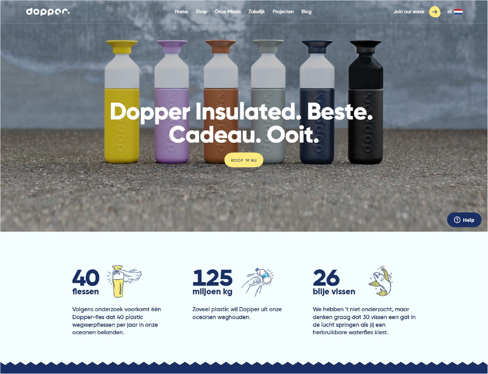
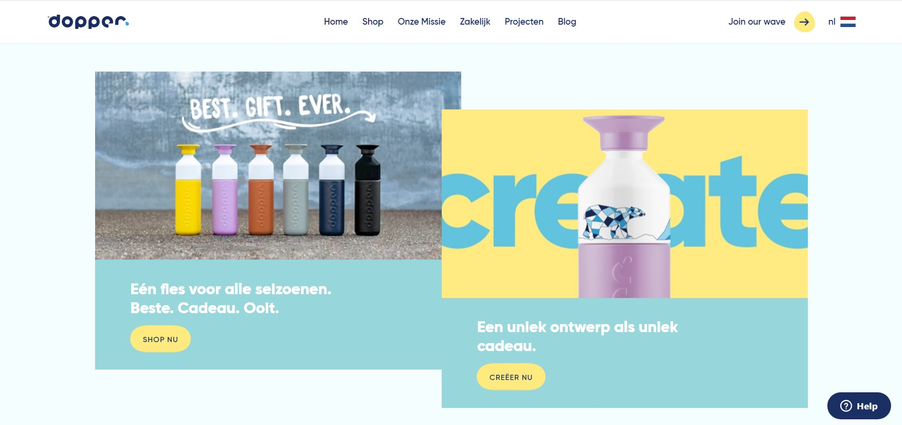
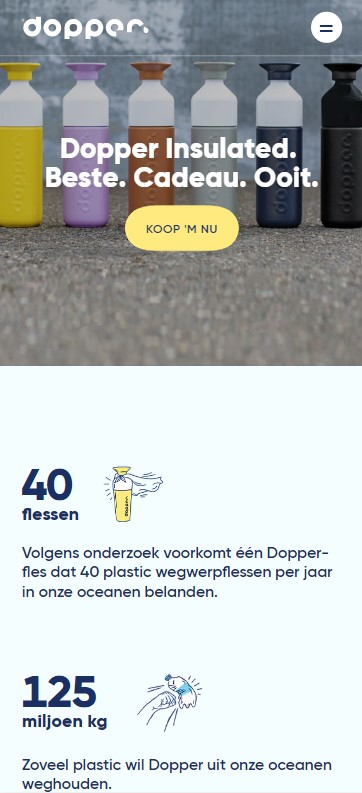

#### Screenshot(s) van de tweede pagina (small screen):
##### Shop (desktop en mobile)
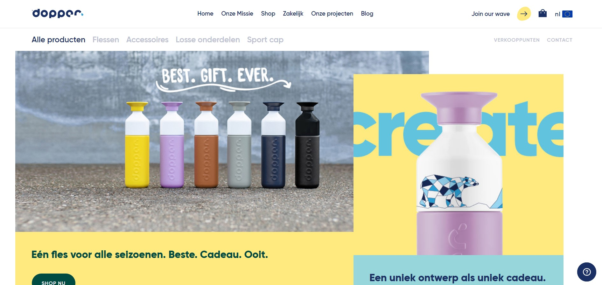
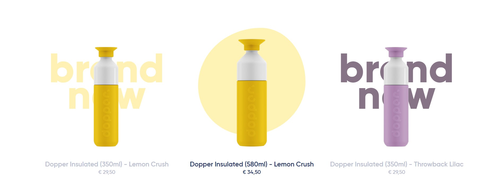
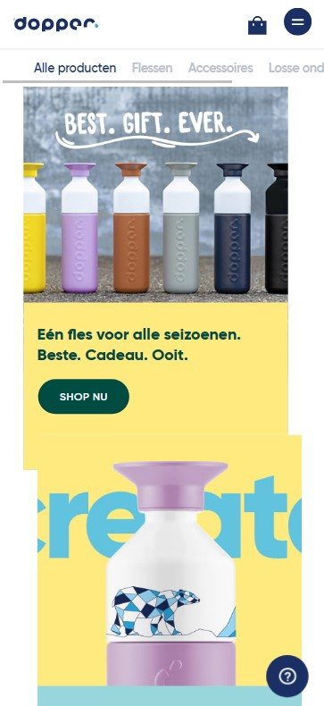
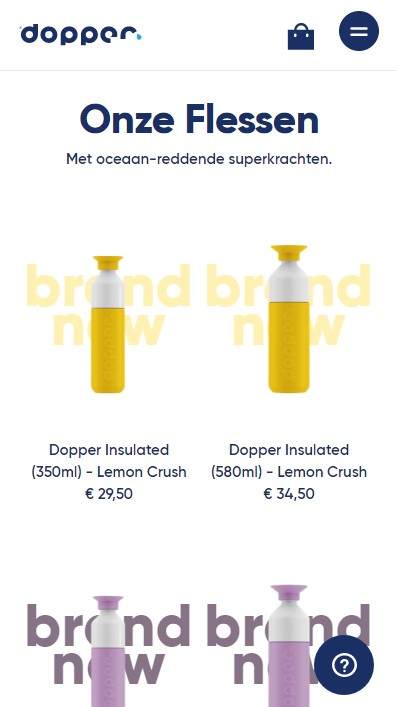

## Breakdownschets (week 1)

uitwerken na afloop 2e werkgroep

### de hele pagina: 
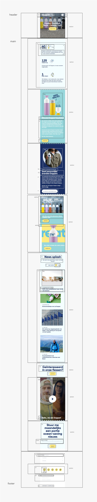

### dynamisch deel (bijv menu): 
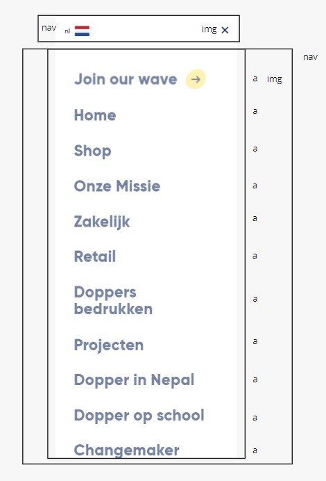

### wellicht nog een dynamisch deel (bijv filter): 
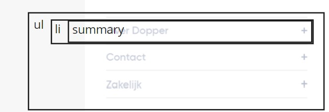

## Voortgang 1 (week 2)

uitwerken voor 1e voortgang

### Stand van zaken
Over het algemeen ging het opzetten van de HTML erg goed. Ik liep er tegenaan dat de breakdown schets die ik had gemaakt voor de pagina, op sommige plekken niet zo werkte als gehoopt. Deze heb ik vervolgens aangepast. 
De HTML heb ik door een validator gehaald en heb ik de warnings (geen errors, yay!) weggewerkt door de HTML volledig af te maken. Ik ben begonnen met de CSS.
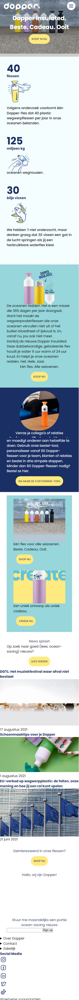
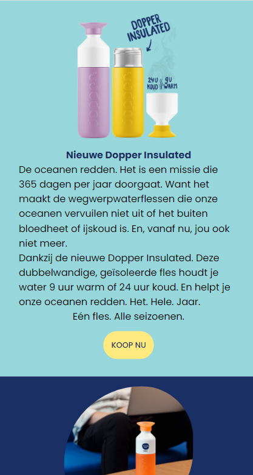
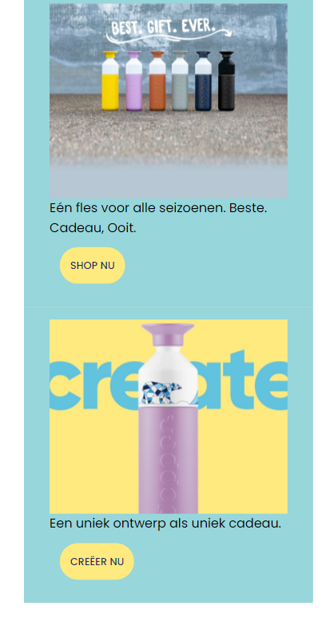
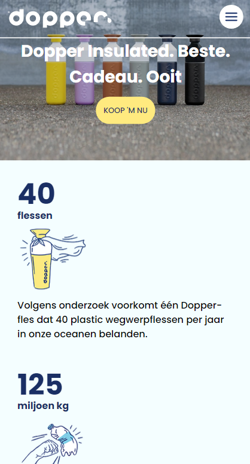

### Agenda voor meeting
samen met je groepje opstellen

| Rosella Moens     | Ilias Ouyaliz       | Hong Zhou    | Stefan Radouane        |
| ---            | ---                | ---          | ---              |
| sections zonder heading  | werken met mediaqueries   | transparante animatie in achtergrond | a centreren in li    |
| h3 twee woorden apart stylen css| online fonts en iconen gebruiken | google maps op je website | items aan dropdown toevoegen |
| crop images asymmetrisch  | flexbox met 1 kolom of meerdere beginnen   | img grijswaarde maken op css  | lijst onzichtbaar maken met knop              |

### Verslag van meeting
hier na afloop snel de uitkomsten van de meeting vastleggen

- ul li nav
- getal als span in 1 h3
- h2 van titels vd sections sections
- h3tjes voor sections in sections
- articles van sections in sections
- <a href "#"> doen!
- p niet nodig bij datetime!
- summary details goed: vooral doen
- css clip path maker blob voor hoverimg shop.html - clippath https://bennettfeely.com/clippy/

## Voortgang 2 (week 3)

uitwerken voor 2e voortgang

### Stand van zaken
Ik heb na de feedback van vorige week aanpassingen gedaan aan de HTML. Ik ben daarna weer verder gegaan aan de CSS. Deze heb ik van bovenaf de pagina naar beneden opgezet. De image in de header heb ik door deze week heen ook gewijzigd naar een background image. Wanneer ik de pagina schaalde, kwam ik namelijk tegen problemen aan. 
Ik heb de CSS door een validator gehaald en daaruit kwamen drie warnings. Deze heb ik aangepast.
Over het algemeen ging het dus erg goed deze week. Ik heb een paar vragen gesteld en ook anderen geholpen met hun CSS tijdens de werkgroep. 

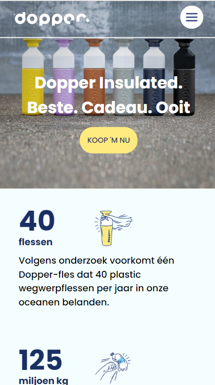
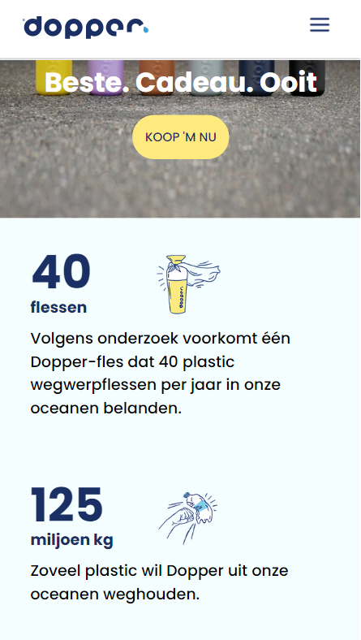
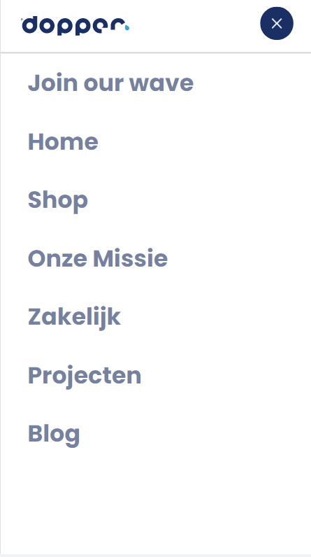
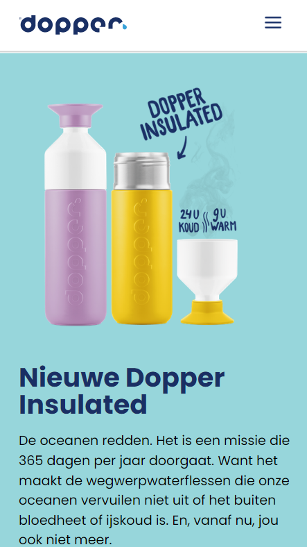
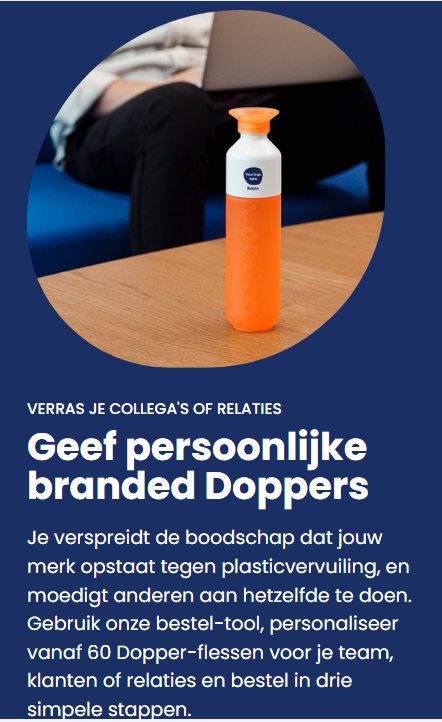
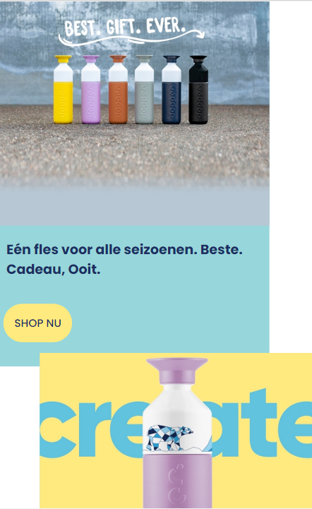
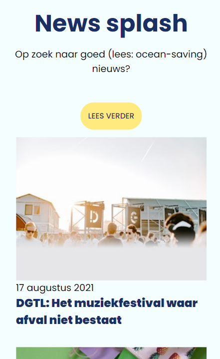
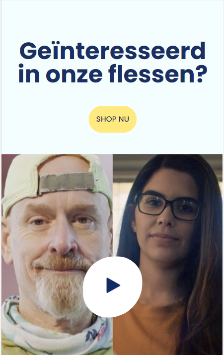
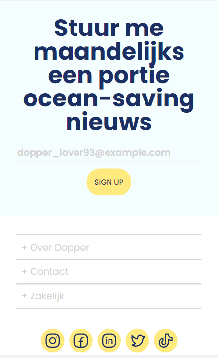

### Agenda voor meeting
samen met je groepje opstellen

| Rosella Moens | Ilias Ouyaliz | Hong Zhou | Stefan Radouane  |
| ---            | ---                | ---          | ---   |
| JS/CSS header kruisje/hamburger | Hamburger menu layout | Mag een tweede css pagina?    | img met transition  |
| CSS tweede HTML pagina | CSS grid grootte | CSS background-image cover centreren? | Meerdere elementen querySelectorAll |
| Hoeveel media queries?  | Hoe exact namaken? | Hover van afbeelding naar video | Achtergrond een wazige kleur geven  |

### Verslag van meeting
hier na afloop snel de uitkomsten van de meeting vastleggen

- punt 1
- punt 2
- nog een punt
- ...

## Toegankelijkheidstest (week 4)

uitwerken na test in 8e voortgang

### Bevindingen
Lijst met je bevindingen die in de test naar voren kwamen:

#### Titel eerste bevinding
Hier korte omschrijving (met indien nodig een afbeelding)

Hier een omschrijving van hoe het opgelost kan worden (met indien nodig een afbeelding)

#### Titel tweede bevinding. 
Hier korte omschrijving (met indien nodig een afbeelding)

Hier een omschrijving van hoe het opgelost kan worden (met indien nodig een afbeelding)

#### Titel volgende bevinding. 
Hier korte omschrijving (met indien nodig een afbeelding)

Hier een omschrijving van hoe het opgelost kan worden (met indien nodig een afbeelding)

#### Titel nog een bevinding. 
Hier korte omschrijving (met indien nodig een afbeelding)

Hier een omschrijving van hoe het opgelost kan worden (met indien nodig een afbeelding)

## Voortgang 3 (week 4)

uitwerken voor 3e voortgang

### Stand van zaken
hier dit ging goed & dit was lastig (neem ook screenshots op van delen van je website en code)

### Agenda voor meeting
samen met je groepje opstellen

| student 1      | student 2          | student 3    | student 4        |
| ---            | ---                | ---          | ---              |
| dit bespreken  | en dit             | en ik dit    | en dan ik dat    |
| en dat ook nog | dit als er tijd is | nog een punt | dit wil ik zeker |
| ...            | ...                | ...          | ...              |

### Verslag van meeting
hier na afloop snel de uitkomsten van de meeting vastleggen

- punt 1
- punt 2
- nog een punt
- ...

## Eindgesprek (week 5)

uitwerken voor eindgesprek

### Stand van zaken
hier dit ging goed & dit was lastig (neem ook screenshots op van delen van je website en code)

### Screenshot(s)

hier screenshot(s) van je eindresultaat

## Bronnenlijst

continu bijhouden terwijl je werkt

Nb. Wees specifiek ('css-tricks' als bron is bijv. niet specifiek genoeg).

1. CSS Overflow (w3Schools) https://www.w3schools.com/cssref/pr_pos_overflow.asp
2. CSS Overlays (w3Schools) https://www.w3schools.com/howto/howto_css_overlay.asp
3. CSS border-radius (9elements) https://9elements.com/blog/css-border-radius/
4. CSS color overlay background-image (stackoverflow, css-tricks) https://stackoverflow.com/questions/36679649/how-to-add-a-color-overlay-to-a-background-image/36679903 & https://css-tricks.com/snippets/css/css-box-shadow/
5. CSS word-break voor ul li h3 (w3schools) https://www.w3schools.com/cssref/css3_pr_word-break.asp
6. JS scrollTop (stackoverflow, mozilla) https://stackoverflow.com/questions/32068340/change-text-after-scrolling & https://developer.mozilla.org/en-US/docs/Web/API/Element/scrollTop
7. JS/CSS Styling scroll positions (css-tricks) https://css-tricks.com/styling-based-on-scroll-position/
8. JS/CSS Text animeren: voorbeelden (tobiasahlin) https://tobiasahlin.com/moving-letters/
9. CSS style placeholder text for input (mozilla & codegrepper) https://developer.mozilla.org/en-US/docs/Web/CSS/::placeholder & https://www.codegrepper.com/code-examples/html/html+input+suggested+text
10.

