# Procesverslag
<!-- Markdown is een simpele manier om HTML te schrijven.  
Markdown cheat cheet: [Hulp bij het schrijven van Markdown](https://github.com/adam-p/markdown-here/wiki/Markdown-Cheatsheet).

Nb. De standaardstructuur en de spartaanse opmaak van de README.md zijn helemaal prima. Het gaat om de inhoud van je procesverslag. Besteedt de tijd voor pracht en praal aan je website.

Nb. Door *open* toe te voegen aan een *details* element kun je deze standaard open zetten. Fijn om dat steeds voor de relevante stuk(ken) te doen. -->

## Jij

uitwerken voor kickoff

### Auteur:
Rosella Moens

#### Je startniveau:
Rood

#### Je focus:
Surface plane, maar het lijkt me leuk om ook Responsive daar bovenop te doen. 
 

## Je website

uitwerken voor kickoff

### Je opdracht:
https://dopper.com/nl en https://shop.dopper.com/

#### Screenshot(s) van de eerste pagina (small screen): 
##### Homepage (desktop en mobile) 

#### Screenshot(s) van de tweede pagina (small screen):
##### Shop (desktop en mobile)

## Breakdownschets (week 1)

uitwerken na afloop 2e werkgroep

### de hele pagina: 

### dynamisch deel (bijv menu): 

### wellicht nog een dynamisch deel (bijv filter): 

## Voortgang 1 (week 2)

uitwerken voor 1e voortgang

### Stand van zaken
Over het algemeen ging het opzetten van de HTML erg goed. Ik liep er tegenaan dat de breakdown schets die ik had gemaakt voor de pagina, op sommige plekken niet zo werkte als gehoopt. Deze heb ik vervolgens aangepast. 
De HTML heb ik door een validator gehaald en heb ik de warnings (geen errors, yay!) weggewerkt door de HTML volledig af te maken. Ik ben begonnen met de CSS.

### Agenda voor meeting

| Rosella Moens     | Ilias Ouyaliz       | Hong Zhou    | Stefan Radouane        |
| ---            | ---                | ---          | ---              |
| sections zonder heading  | werken met mediaqueries   | transparante animatie in achtergrond | a centreren in li    |
| h3 twee woorden apart stylen css| online fonts en iconen gebruiken | google maps op je website | items aan dropdown toevoegen |
| crop images asymmetrisch  | flexbox met 1 kolom of meerdere beginnen   | img grijswaarde maken op css  | lijst onzichtbaar maken met knop              |

### Verslag van meeting
- Van nav een ul maken
- Getal als span in 1 h3
- h2 van titels vd sections sections
- h3tjes voor sections in sections
- articles van sections in sections
- <a href "#"> doen!
- P niet nodig bij datetime!
- Summary details goed: vooral doen
- CSS clip path maker blob voor hovering shop.html - clippath https://bennettfeely.com/clippy/ (ik ga het proberen!)

## Voortgang 2 (week 3)

uitwerken voor 2e voortgang

### Stand van zaken
Ik heb na de feedback van vorige week aanpassingen gedaan aan de HTML. Ik ben daarna weer verder gegaan aan de CSS. Deze heb ik van bovenaf de pagina naar beneden opgezet. De image in de header heb ik door deze week heen ook gewijzigd naar een background image. Wanneer ik de pagina schaalde, kwam ik namelijk tegen problemen aan. 
Ik heb de CSS door een validator gehaald en daaruit kwamen drie warnings. Deze heb ik aangepast.
Over het algemeen ging het dus erg goed deze week. Ik heb een paar vragen gesteld en ook anderen geholpen met hun CSS tijdens de werkgroep. 

### Agenda voor meeting

| Rosella Moens | Ilias Ouyaliz | Hong Zhou | Stefan Radouane  |
| ---            | ---                | ---          | ---   |
| JS/CSS header kruisje/hamburger | Hamburger menu layout | Mag een tweede css pagina?    | img met transition  |
| CSS tweede HTML pagina | CSS grid grootte | CSS background-image cover centreren? | Meerdere elementen querySelectorAll |
| Hoeveel media queries?  | Hoe exact namaken? | Hover van afbeelding naar video | Achtergrond een wazige kleur geven  |

### Verslag van meeting
- Voor de scrollposY kan ik een class toevoegen aan de header (function van scrollPosition).
- Wanneer ik de functions herschrijf, kan ik ook het iconen probleem oplossen (update: fixed!)
- Strong ipv Span om h3? Nog even over nadenken.
- Verder super goed bezig!!

## Toegankelijkheidstest (week 4)

uitwerken na test in 8e voortgang

### Bevindingen
Lijst met je bevindingen die in de test naar voren kwamen:  
 <strong>Keyboard en screenreader</strong>
 - Mobile: screenreader en tab knop lezen/selecteren alle nav a items, het menu wordt niet opengevouwen.
 - Button video, Sign up button en eerste sections a's moeten nog een :focus, :hover & :active styling
 
 <strong>Brillen</strong>
 - Blur/glare:
    - Nieuwsartikelen de titels zijn te dik
    - Placeholder niet goed leesbaar
    - Lichtgrijze tekst in footer niet goed leesbaar
 - Heimfield Loss:
    - Geen inzichten/bevindingen
 - Color:
    - Kleuren zijn herkenbaar en verschillen genoeg van elkaar. Contrast is goed.
 
#### Screenreader leest nav, maar vouwt niet uit.
Wanneer alleen de screenreader wordt gebruikt, wordt het hamburgermenu niet geopend, maar worden wel de list items hierin voorgelezen. Hetzelfde geldt als je enkel tabt door de site. De nav elementen worden geselecteerd maar zijn niet zichtbaar.

Oplossing  
Dit is dus op zichzelf niet een heel groot probleem. Mensen die rekenen op de screen-reader hebben de visuele ondersteuning niet. Hierdoor is de relevantie van dit inzicht niet noodzakelijk. Ik heb wel de hamburger-button een display: none; gegeven ipv een visibility: hidden;, zodat hij niet meer op tablet/laptop modus geselecteerd kan worden door de tab-toets.

#### Niet alle selecteerbare elementen hebben nog een focus, hover en active state. 
De a over de video, de sign up button en de links in de eerste section van shop.html hebben nog geen focus, hover en active state.

Oplossing  
Ik ga states toevoegen aan deze 3 elementen, zodat de toegankelijkheid groter is. Ook moet ik nog iets fixen betreft de focus state van de Dopper images op de shop page.

#### Titels van de nieuwsartikelen zijn niet goed leesbaar. 
Wanneer de gebruiker slecht zicht heeft (blur/glare bril), zijn de titels van de nieuwsartikelen niet duidelijk leesbaar. De font-weight is te dik. 

Oplossing  
Font-weight aanpassen zodat het dunner is.

#### Lichtgrijze placeholder van input en links in footer niet goed leesbaar. 
Wanneer de gebruiker slecht zicht heeft (blur/glare bril), zijn de licht-grijze teksten niet goed zichtbaar.

Oplossing  
Color aanpassen zodat het opvallender is en het contrast hoger is..
 

## Voortgang 3 (week 4)

uitwerken voor 3e voortgang

### Stand van zaken
Ik ben bijna klaar met de HTML/CSS en JS. De HTML en CSS waren me voornamelijk goed afgegaan. Ik had wat problemen met de scroll function die ik had geschreven in JS. Ik heb verschillende dingen geprobeerd, waardoor ik niet echt het resultaat kreeg waarop ik had gehoopt. De scroll eventListener die ik had opgesteld glitchde raar. Met een beetje hulp van de docent (Robert) is het gelukt om de functie op te zetten. Ik was er wel bijna! Nadat dit was de grootste struggle gelukkig voorbij. 
 
 <strong>De site voldoet aan de eisen van de surface plane en is nu ook responsive!</strong>
 
Het is nu nog een kwestie van kleine details en het zetten van de puntjes op de i. Vooral de CSS moet ik nog aanpassen adhv de Toegangelijkheidstest van deze week. Daarnaast wil ik nog een animatie aanmaken voor de tekst in de header banner.
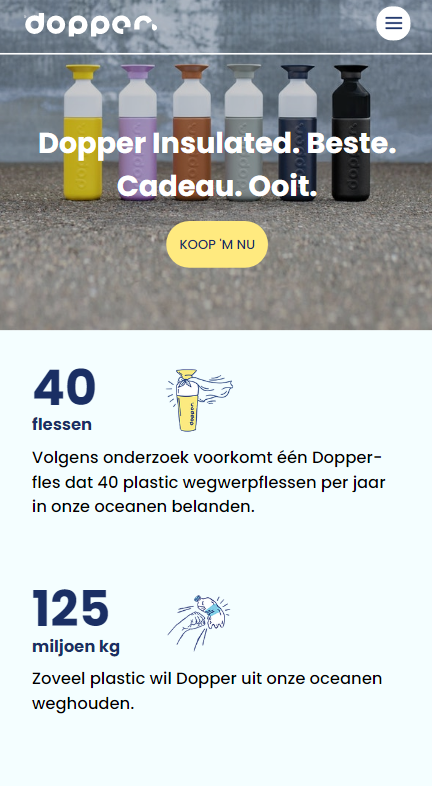
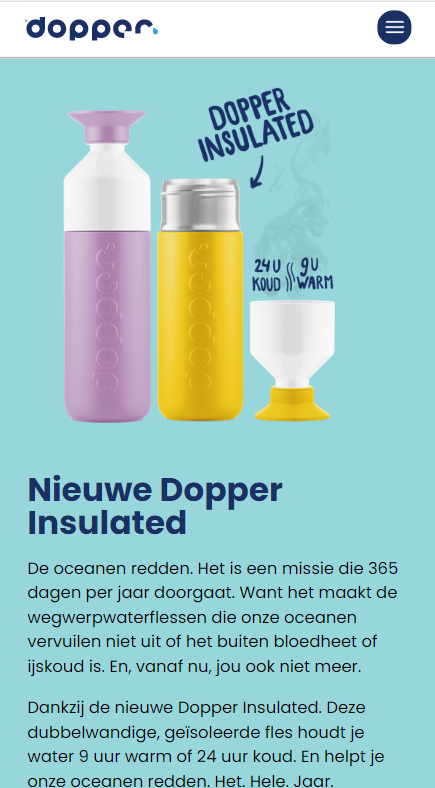
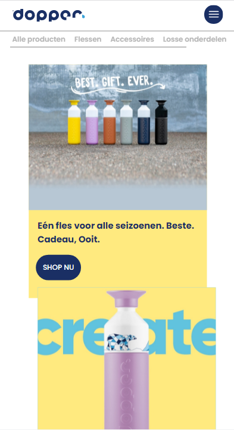
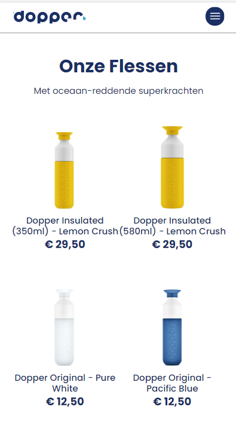
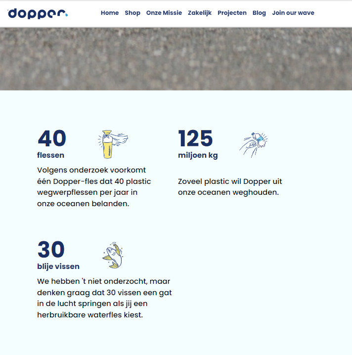
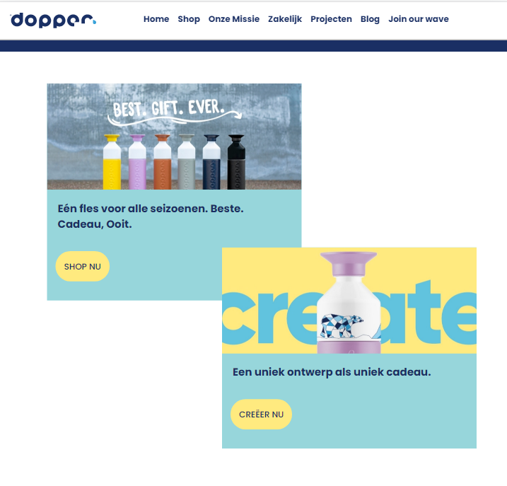
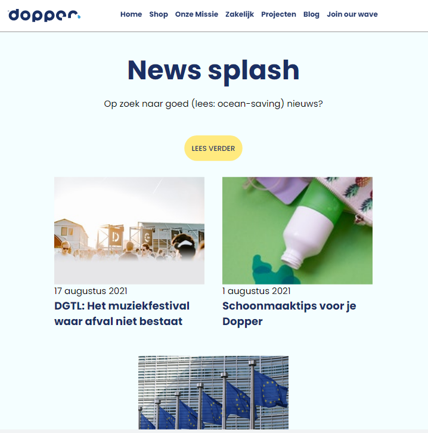
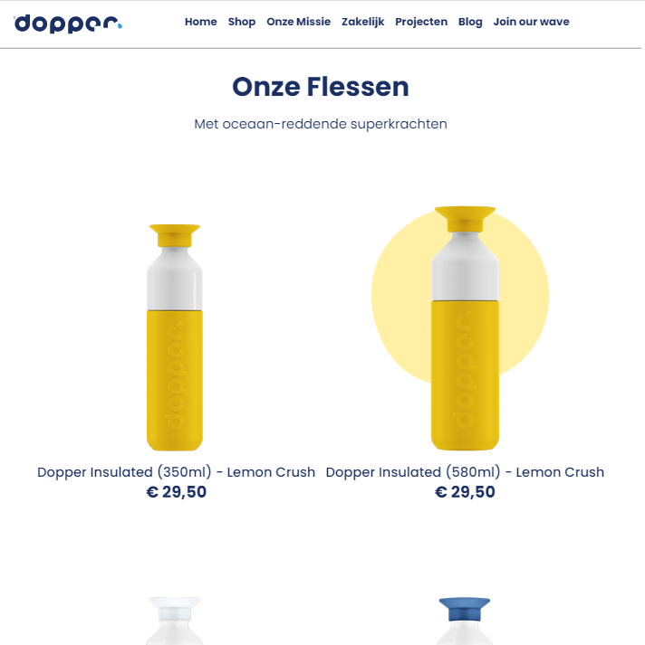

### Agenda voor meeting

| Rosella Moens      | Hong Zhou          | Ilias Ouyaliz   | Stefan Radouane      |
| ---            | ---                | ---          | ---              |
| Header js animation | Met media queries img src aanpassen | Flexbox en css grid| Accordion maken |
| Darkmode colors in root | 9 images toevoegen met 1 button | Logo in midden | SVG stroke uitlijnen naar binnen |
| Footer flexen? | hamburger menu animatie  | Images width   | Pagina's overeenkomen?  |

### Verslag van meeting
- Ik ben goed bezig!
- Code is netjes
   - Comments in CSS goed
- Animatie zeker proberen na te bootsen
  - Al is het anders, that's fine.
- Darkmode niet nodig, je hebt al genoeg features
- Footer kan ik nog flexen, geen prioriteit aan stellen

## Eindgesprek (week 5)

uitwerken voor eindgesprek

### Stand van zaken
Na het laatste voortgangsgesprek ben ik verder gegaan met het toevoegen van de laatste details. Ik heb de laatste aanpassingen gedaan aan de CSS, waaronder de aanpassingen adhv de Toegankelijkheidstest en de animatie voor op de H1 op de home page.  
Ik ben super tevreden met mijn eindresultaat. Het is me toch gelukt om de surface plane uit te werken én de site responsive te maken. De Dopper website was een goede uitdaging voor mij om na te maken, doordat er veel aandacht is besteed aan de sites styling, animaties en responsiveness. Uiteindelijk heb ik een resultaat dat wel heel dichtbij de echte Dopper site komt! 
Ik heb vooral veel mogen leren over CSS animatie (ik wist niet eens dat dat bestond..) en JS events tijdens het nabouwen van de website. Ik ben erg trots op mezelf dat ik dit from scratch heb kunnen maken. Ik heb mezelf constant gepushed om vooruit te werken om het ook mogelijk te maken om eigenlijk beiden focussen te doen.

### Screenshot(s)
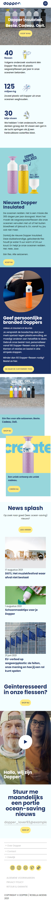
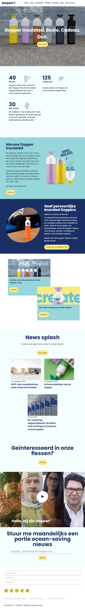

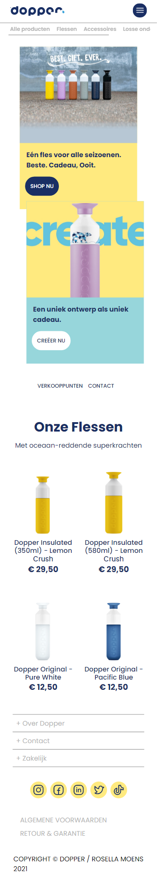
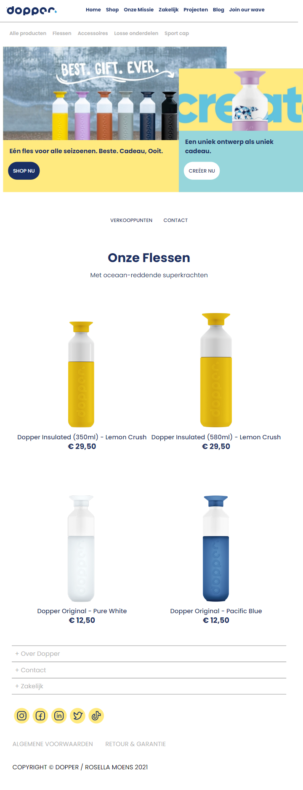

## Bronnenlijst

continu bijhouden terwijl je werkt

Nb. Wees specifiek ('css-tricks' als bron is bijv. niet specifiek genoeg).

1. CSS Overflow (w3Schools) https://www.w3schools.com/cssref/pr_pos_overflow.asp
2. CSS Overlays (w3Schools) https://www.w3schools.com/howto/howto_css_overlay.asp
3. CSS border-radius (9elements) https://9elements.com/blog/css-border-radius/
4. CSS color overlay background-image (stackoverflow, css-tricks) https://stackoverflow.com/questions/36679649/how-to-add-a-color-overlay-to-a-background-image/36679903 & https://css-tricks.com/snippets/css/css-box-shadow/
5. CSS word-break voor ul li h3 (w3schools) https://www.w3schools.com/cssref/css3_pr_word-break.asp
6. JS scrollTop (stackoverflow, mozilla) https://stackoverflow.com/questions/32068340/change-text-after-scrolling & https://developer.mozilla.org/en-US/docs/Web/API/Element/scrollTop
7. JS/CSS Styling scroll positions (css-tricks) https://css-tricks.com/styling-based-on-scroll-position/
8. JS/CSS Text animeren: leuke voorbeelden van letter by letter (Tobias Ahlin) https://tobiasahlin.com/moving-letters/
9. CSS style placeholder text for input (mozilla & codegrepper) https://developer.mozilla.org/en-US/docs/Web/CSS/::placeholder & https://www.codegrepper.com/code-examples/html/html+input+suggested+text
10. CSS text op 1 lijn (stackoverflow) https://stackoverflow.com/questions/17704539/css-getting-text-in-one-line-rather-than-two
11. CSS Clip-paths (ishadeed, bennetfeely) https://ishadeed.com/article/clip-path/ & https://bennettfeely.com/clippy/
12. CSS Blobs (blobmaker, css-tricks)https://www.blobmaker.app/ & https://css-tricks.com/blobs/
13. CSS SVG fill and strokes (mozilla) https://developer.mozilla.org/en-US/docs/Web/SVG/Tutorial/Fills_and_Strokes
14. CSS Animations: hoe en wat (mozilla) https://developer.mozilla.org/en-US/docs/Web/CSS/CSS_Animations/Using_CSS_animations
15. CSS Animations met html made svg's (css-tricks, stackoverflow) https://css-tricks.com/animate-svg-path-changes-in-css/ & https://stackoverflow.com/questions/51614659/how-to-animate-svg-path-d-attribute-with-animate-tag
16. CSS Media Queries (browserstack) https://www.browserstack.com/guide/what-are-css-and-media-query-breakpoints
17. CSS object-fit (digitalocean & mozilla) https://www.digitalocean.com/community/tutorials/css-cropping-images-object-fit & https://developer.mozilla.org/en-US/docs/Web/CSS/object-position?retiredLocale=nl
18. CSS hiding elements with display & visibility (allyjs) https://allyjs.io/tutorials/hiding-elements.html
19. CSS animation-timing (mozilla) https://developer.mozilla.org/en-US/docs/Web/CSS/animation-timing-function
20. CSS animation-fill-mode (mozilla & cubic-bezier) https://developer.mozilla.org/en-US/docs/Web/CSS/animation-fill-mode & https://cubic-bezier.com/#

